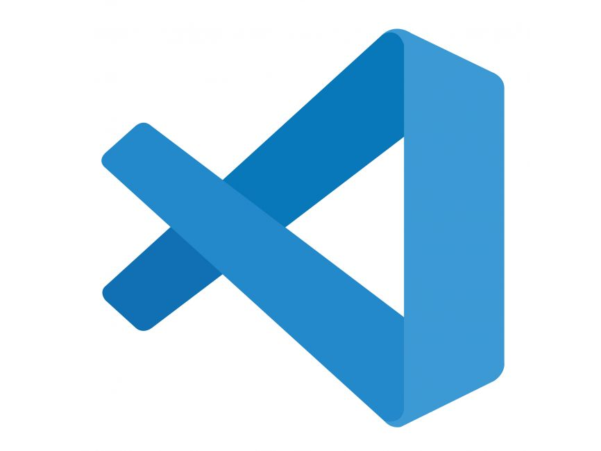

<!-- HEADINGS -->

# my title
## my title h2
### my title h3
#### my title h4
##### my title h5
###### my title h6

<!-- italic -->
this is an *italic* text

<!-- strong -->
this is an **strong** text

<!-- strikethrough -->
este es un ~~texto~~ tachado 


<!-- UL -->
* apple
    * apple
* Orange
    * orange
* etc

1. apple
2. orange
3. etc

[faztweb.com](https://www.faztweb.com)

[faztweb.com](https://www.faztweb.com "Custom title")

> this is a quote

---
___


`console.log('hello world')`

```javascript
const mongoose = require('mongoose');

mongoose.set('useFindAndModify', false);
mongoose.connect('mongodb://localhost/node-notes-db', {
    useCreateIndex: true,
    useNewUrlParser: true
})
    .then(db => console.log('DB is connected'))
    .catch(err => console.error(err));
```

```python
print("hello world")
```

```html
<h1>helloworld</h1>
```

| Tables          | Are           | Cool    |
|-----------------|:-------------:| -------:|
| col 3 is        | right-aligned |  $1600  |
| col 2 is        | centered      |    $12  |
| zebra stripes   | are neat      |     $1  |

 

<!-- GITHUB MARKDOWN -->
* [x] Task 1
* [ ] Task 2
* [ ] Task 3
* [x] Task 4

@aemabit :smiley: :+1:
